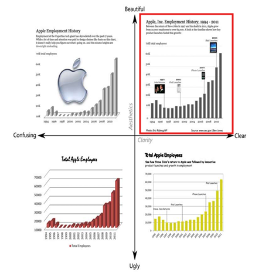
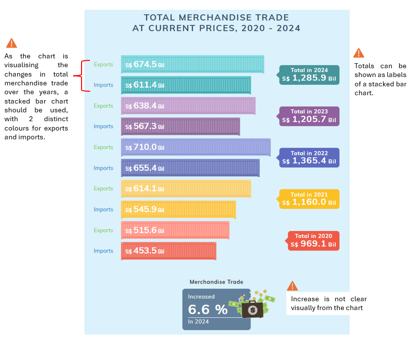
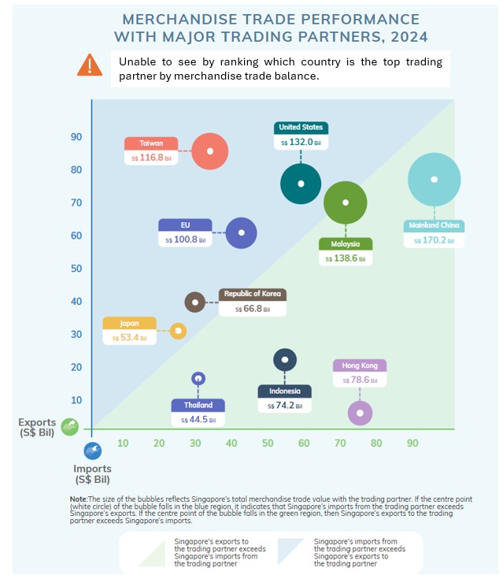
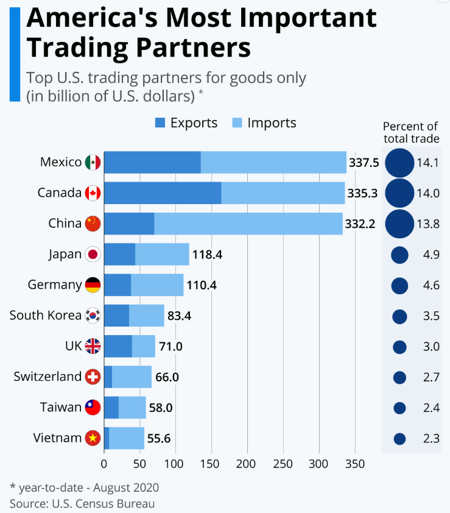
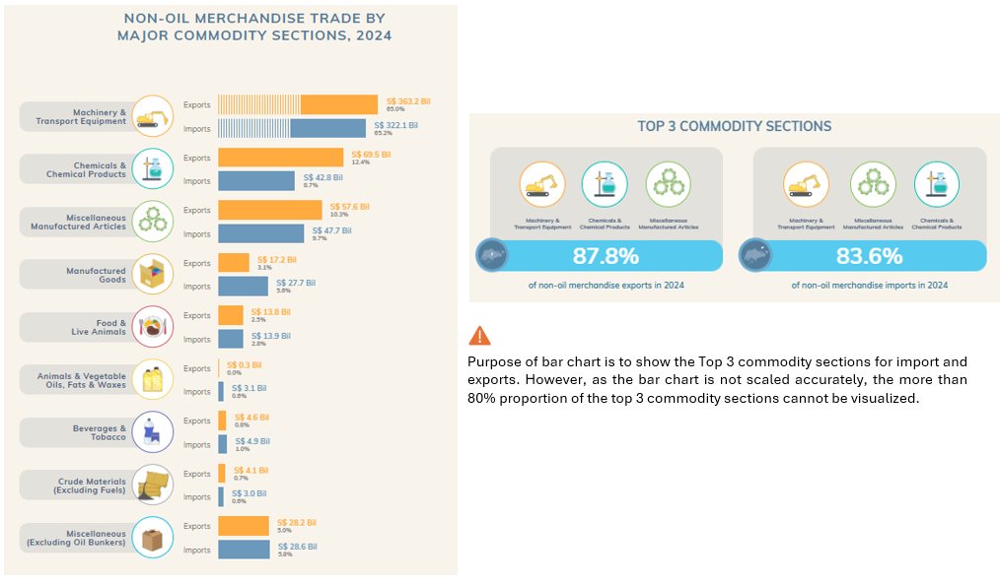

## 1 Overview of the Task

Since Mr. Donald Trump took office as the President of the United States on January 20, 2025, one of the most closely watched topics has been global trade.

As a beginner in visual analytics, I will be applying newly learned skills to examine the **evolving trends in Singapore’s international trade since 2015** using data and visualisation from Department of Statistics Singapore and Singstat.

The task includes:

-   selecting **three data visualisations** on [this page (Singstat Infographics)](https://www.singstat.gov.sg/modules/infographics/singapore-international-trade), comments on the pros and cons and provide sketches of the make-over,

-   creating the make-over of the three data visualisation critic above using appropriate packages, and

-   analysing the data with either time-series analysis or time-series forecasting methods

### 1.1 Principles of Data Visualisation Design

Before starting on the critic for the 3 data visualisations, we would first need to understand the key principles of data visualisation design.

Firstly, we need to ensure that we are using the right visuals to represent the data and ensure graphical integrity. Snapshots of the data over specific time periods, or across specific groups can be misleading and not representative of any trends.

Visuals should also be simplified, using effective colours and clear labels to provide clarity for the audience. Annotations can be used to provide more insights to the visuals. Lastly, we should aim to create charts that fall within Quadrant 1, where it is clear and aesthetically beautiful.

{width="478"}

### 1.2 The Dataset

The data visualisations on the Singstat Infographics website are on Singapore's international trade position, mainly describing the trade components and identifying Singapore's major trading partners from the period of 2020 to 2024. For purpose of the critic and make-over, we will mainly be working with **multiple datasets**:

1.  Total Merchandise Trade -
2.  By region/market
3.  By region/market
4.  By region/market

#### 1.2.1 Load Packages

```{r}
pacman::p_load(scales, viridis, lubridate, ggthemes,
               gridExtra, readxl, knitr, data.table,
               CGPfunctions, ggHoriPlot, tidyverse)
```

#### 1.2.2 Import Data

::: panel-tabset
## Total Merchandise Trade

```{r}
#| results: hide
mer_trade <- read_excel("data/Merchandise_trade.xlsx")
```

## By Region/Market - Imports

```{r}
#| results: hide
imports <- read_excel("data/Merchandise_trade_imports.xlsx")
```

## By Region/Market - Domestic Exports

```{r}
#| results: hide
dom_exports <- read_excel("data/Merchandise_trade_domexports.xlsx")
```

## By Region/Market - Re-Exports

```{r}
#| results: hide
re_exports <- read_excel("data/Merchandise_trade_reexports.xlsx")
```
:::

### 1.3 Data Preparation

#### 1.3.1 Remove unnecessary rows from dataset

::: panel-tabset
## Total Merchandise Trade

```{r}
#| code-fold: true
#| code-summary: "Click to view code"
df_mer_trade <- mer_trade %>% 
  slice(10:78)  
colnames(df_mer_trade) <- as.character(df_mer_trade[1, ])  
df_mer_trade <- df_mer_trade %>% 
  slice(-1)  
```

```{r}
head(df_mer_trade)
```

## By Region/Market - Imports

```{r}
#| code-fold: true
#| code-summary: "Click to view code"
df_imports <- imports %>% 
  slice(10:170)  
colnames(df_imports ) <- as.character(df_imports [1, ])  
df_imports <- df_imports  %>% 
  slice(-1)
```

```{r}
head(df_imports)
```

## By Region/Market - Domestic Exports

```{r}
#| code-fold: true
#| code-summary: "Click to view code"
df_dom_exports <- dom_exports %>% 
  slice(10:170)  
colnames(df_dom_exports) <- as.character(df_dom_exports[1, ])  
df_dom_exports <- df_dom_exports  %>% 
  slice(-1)
```

```{r}
head(df_dom_exports)
```

## By Region/Market - Re-Exports

```{r}
#| code-fold: true
#| code-summary: "Click to view code"
df_re_exports <- re_exports %>% 
  slice(10:170)  
colnames(df_re_exports) <- as.character(df_re_exports[1, ])  
df_re_exports <- df_re_exports  %>% 
  slice(-1)
```

```{r}
head(df_re_exports)
```
:::

#### 1.3.2 Creating Unique identifiers - Total Merchandise Trade

As the data is structured to have repeated series name (see codes below), we will first need to create unique identifier names to separate between total merchandise, imports, domestic exports and re-exports before summing up the yearly amounts.

```{r}
#| code-fold: true
#| code-summary: "Click to view code"
df_mer_trade %>%
  count(`Data Series`, name = "Count") %>%
  filter(Count > 1)
```

```{r}
#| code-fold: true
#| code-summary: "Click to view code"
df_mer_trade <- df_mer_trade %>%
  mutate(ID = case_when(
    between(row_number(), 2, 14) ~ paste0("Tot_", `Data Series`),
    between(row_number(), 16, 27) ~ paste0("Imp_", `Data Series`),
    between(row_number(), 29, 41) ~ paste0("Exp_", `Data Series`),
    between(row_number(), 43, 55) ~ paste0("Dom_", `Data Series`),
    between(row_number(), 57, 68) ~ paste0("ReE_", `Data Series`),
    TRUE ~ paste0(`Data Series`)  # Default values for other rows
  )) %>%
  select(ID, everything())
```

```{r}
head(df_mer_trade)
```

#### 1.3.3 Group Data by Year

::: panel-tabset
## Total Merchandise Trade

```{r}
#| code-fold: true
#| code-summary: "Click to view code"
grpdf_mer_trade <- df_mer_trade %>%
  pivot_longer(
    cols = matches("^\\d{4} [A-Za-z]{3}$"),  # Match columns like "2024 Dec", "2015 Jan", etc.
    names_to = "Month",
    values_to = "Value"
  ) %>%
  mutate(
    Year = as.integer(sub("^(\\d{4}) .*", "\\1", Month)),  # Extract year (e.g., 2024 from "2024 Dec")
    MonthName = sub("^\\d{4} (.*)", "\\1", Month),  # Extract month name (e.g., "Dec" from "2024 Dec")
    Value = as.numeric(Value)
  ) %>%
  group_by(ID, Year) %>%
  summarize(
    Annual_Amt = sum(Value, na.rm = TRUE),
    .groups = "drop"
  )
```

```{r}
head(grpdf_mer_trade)
```

## By Region/Market - Imports

```{r}
#| code-fold: true
#| code-summary: "Click to view code"
grpdf_imports <- df_imports %>%
  pivot_longer(
    cols = matches("^\\d{4} [A-Za-z]{3}$"),  # Match columns like "2024 Dec", "2015 Jan", etc.
    names_to = "Month",
    values_to = "Value"
  ) %>%
  mutate(
    Year = as.integer(sub("^(\\d{4}) .*", "\\1", Month)),  # Extract year (e.g., 2024 from "2024 Dec")
    MonthName = sub("^\\d{4} (.*)", "\\1", Month),  # Extract month name (e.g., "Dec" from "2024 Dec")
    Value = as.numeric(Value)
  ) %>%
  group_by(`Data Series`, Year) %>%
  summarize(
    Annual_Amt = sum(Value, na.rm = TRUE),
    .groups = "drop"
  )
```

```{r}
head(grpdf_imports)
```

## By Region/Market - Domestic Exports

```{r}
#| code-fold: true
#| code-summary: "Click to view code"
grpdf_dom_exports <- df_dom_exports %>%
  pivot_longer(
    cols = matches("^\\d{4} [A-Za-z]{3}$"),  # Match columns like "2024 Dec", "2015 Jan", etc.
    names_to = "Month",
    values_to = "Value"
  ) %>%
  mutate(
    Year = as.integer(sub("^(\\d{4}) .*", "\\1", Month)),  # Extract year (e.g., 2024 from "2024 Dec")
    MonthName = sub("^\\d{4} (.*)", "\\1", Month),  # Extract month name (e.g., "Dec" from "2024 Dec")
    Value = as.numeric(Value)
  ) %>%
  group_by(`Data Series`, Year) %>%
  summarize(
    Annual_Amt = sum(Value, na.rm = TRUE),
    .groups = "drop"
  )
```

```{r}
head(grpdf_dom_exports)
```

## By Region/Market - Re-Exports

```{r}
#| code-fold: true
#| code-summary: "Click to view code"
grpdf_re_exports <- df_re_exports %>%
  pivot_longer(
    cols = matches("^\\d{4} [A-Za-z]{3}$"),  # Match columns like "2024 Dec", "2015 Jan", etc.
    names_to = "Month",
    values_to = "Value"
  ) %>%
  mutate(
    Year = as.integer(sub("^(\\d{4}) .*", "\\1", Month)),  # Extract year (e.g., 2024 from "2024 Dec")
    MonthName = sub("^\\d{4} (.*)", "\\1", Month),  # Extract month name (e.g., "Dec" from "2024 Dec")
    Value = as.numeric(Value)
  ) %>%
  group_by(`Data Series`, Year) %>%
  summarize(
    Annual_Amt = sum(Value, na.rm = TRUE),
    .groups = "drop"
  )
```

```{r}
head(grpdf_re_exports)
```
:::

#### 1.3.4 Merge datasets by region/market into 1 data frame and filter out continents (for Critic #2)

```{r}
summarized_list <- list(grpdf_dom_exports, grpdf_re_exports, grpdf_imports)
```

```{r}
summarized_tradepartners <- Reduce(function(x, y) merge(x, y, by = c("Data Series", "Year"), all = TRUE, 
                                                         suffixes = c("_dom_exports", "_re_exports")), summarized_list) %>%
  mutate(`Total Exports` = rowSums(select(., contains("_exports")), na.rm = TRUE)) %>%
  rename(`Total Imports` = `Annual_Amt`) %>%
  rename(`Countries` = `Data Series`) %>%
  select(`Countries`, Year, `Total Exports`, `Total Imports`) %>%
  filter(!`Countries` %in% c("Total All Markets", "America", "Asia", "Europe", "Oceania", "Africa"))
```

## 2 Critic & Make-over of Data Visualisations

### 2.1 Critic #1: Total Merchandise Trade at Current Prices, 2020 - 2024

Data visualisation below aims to show the changes of **total merchandise trade** at current prices over the period of 5 years:

{width="659"}

#### 2.1.1 Pros and Cons of existing data visualisation

✅ Year-on-year increase from previous to current year is clear (Increased 6.6% in 2024)

✅ Chart is sufficiently labelled, with all the amounts standardized to 1 decimal place

❌ Chart only shows year-on-year increase percentage for 1 year, yearly trend is not clear and cannot be visualised as Exports and Imports are separated in 2 bars

❌ Colours used are not visually representative of year, or exports vs imports

❌ Labels showing total amounts by year, but the total amounts cannot be visualised from the chart

#### 2.1.2 Make-over of data visualisation

```{r}
#| code-fold: true
#| code-summary: "Click to view code"
summarized_Crit <- grpdf_mer_trade %>%
  filter(ID %in% c("Total Merchandise Imports, (At Current Prices)",
                   "Total Merchandise Exports, (At Current Prices)")) %>%
  group_by(Year, ID) %>%
  summarize(
    Annual_Amt = sum(Annual_Amt, na.rm = TRUE),  
    .groups = "drop"
  ) %>%
  pivot_wider(
    names_from = ID,  
    values_from = Annual_Amt  
  ) %>%
  pivot_longer(cols = c(`Total Merchandise Exports, (At Current Prices)`, 
                        `Total Merchandise Imports, (At Current Prices)`), 
               names_to = "Category", 
               values_to = "Amount") %>%
  group_by(Year) %>%
  mutate(Trade_Line = sum(Amount, na.rm = TRUE)) %>%
  ungroup()
```

```{r}
#| code-fold: true
#| code-summary: "Click to view code"

ggplot(summarized_Crit) +
  # Stacked bar chart for Exports and Imports (using the original 'Amount' values for the bars)
  geom_bar(aes(x = as.factor(Year), y = Amount, fill = Category), 
           stat = "identity", position = "stack") +
  
  # Add labels to the stacked bars (convert the label values to billions)
  geom_text(aes(x = as.factor(Year), y = Amount, 
                label = paste0(round(Amount / 1e6, 1), " Bil"), fill = Category),
            position = position_stack(vjust = 0.5), size = 3, color = "white") +
  
  # Line for Total Merchandise Trade (sum of Exports and Imports)
  geom_line(aes(x = as.factor(Year), y = Trade_Line, color = "Total Merchandise Trade"), 
            linewidth = 1.5, group = 1) +
  
  # Add points (markers) on the Trade line (convert the value to billions for display)
  geom_point(aes(x = as.factor(Year), y = Trade_Line, color = "Total Merchandise Trade"), 
             size = 3, shape = 16) +
  
  # Add labels to the points on the Trade line (convert the label values to billions)
  geom_text(aes(x = as.factor(Year), 
                y = Trade_Line, 
                label = paste0(round(Trade_Line / 1e6, 1), " Bil"), 
                color = "black"),
            size = 3, vjust = -0.5) +
  
  # Labels and theme
  labs(
    title = "Total Merchandise Exports, Imports, and Trade by Year",
    x = "Year",
    y = "Amount (At Current Prices)",
    fill = "Category",
    color = "Category"
  ) +
  theme_minimal() +
  
  # Flip axes to make the chart horizontal
  coord_flip() +
  
  # Custom colors for Exports, Imports, and Trade line
  scale_fill_manual(values = c("Total Merchandise Exports, (At Current Prices)" = "purple", 
                               "Total Merchandise Imports, (At Current Prices)" = "darkblue")) +
  scale_color_manual(values = c("Total Merchandise Trade" = "darkgrey")) +
  
  # Adjust margins and legend position to avoid clipping
  theme(
    legend.position = "top", 
    legend.justification = "center",
    plot.margin = margin(10, 20, 10, 20), 
    axis.text.x = element_text(size = 8),  
    axis.text.y = element_text(size = 8),  
    axis.title.x = element_text(size = 10),  
    axis.title.y = element_text(size = 10),
    legend.text = element_text(size = 8),
    legend.direction = "vertical"
  )

```

### 2.2 Critic #2: Merchandise Trade Performance with Major Trading Partners, 2024

{width="594"}

#### 2.2.1 Pros and Cons of existing data visualisation

✅ Can be visualised clearly which trading partners Singapore's exports to them exceed our imports from them

✅ Size of bubble reflects the total merchandise trade value well

❌ Bubble plot will not work well if the countries have similar merchandise trade values and the bubbles overlap each other

❌ Not clear on the rankings between trading partners based on total trading volume

Ideal scenario will be like the figure below, where the top 10 trading partners can be clearly visualised with the percentage of exports vs imports clearly seen from the stacked bar chart as well.

{width="506"}

#### 2.2.2 Make-over of data visualisation

```{r}
#| code-fold: true
#| code-summary: "Click to view code"

# Filter by Year and Rank by Data Series for Top 10
summarized_tradepartners <- summarized_tradepartners %>%
  filter(Year %in% c(2024)) %>%  
  mutate(Total_Trade = `Total Exports` + `Total Imports`) %>%
  arrange(desc(`Total_Trade`)) %>%   
  slice_head(n = 10)  
```

```{r}
#| code-fold: true
#| code-summary: "Click to view code"

# Convert data to long format for ggplot
summarized_trade <- summarized_tradepartners %>%
  pivot_longer(cols = c(`Total Exports`, `Total Imports`), 
               names_to = "Category", values_to = "Amount") %>%
  mutate(Countries = reorder(Countries, Total_Trade, sum))

# Calculate the percentage for each segment (export/import) relative to the total trade
summarized_trade <- summarized_trade %>%
  mutate(Percentage = Amount / Total_Trade * 100)

  # Stacked bar chart for Exports and Imports 
ggplot(summarized_trade) +
  geom_bar(aes(x = as.factor(Countries), y = Amount, fill = Category), 
           stat = "identity", position = "stack") +
   
  # Add labels to the stacked bars (convert values to billions)
  geom_text(aes(x = as.factor(Countries), y = Amount, 
                label = paste0(round(Amount / 1e3, 1), " Bil (", 
                               round(Percentage, 1), "%)")),
            position = position_stack(vjust = 0.5), size = 3, color = "white") +
  
  geom_text(data = summarized_tradepartners, 
            aes(x = Countries, y = Total_Trade, 
                label = paste0(round(Total_Trade / 1e3, 1), " Bil")),
            size = 3, color = "black", vjust = -0.5) +
  
  # Labels and theme
  labs(
    title = "Merchandise Trade Performance, 2024",
    x = "Year",
    y = "Amount (At Current Prices)",
    fill = "Category"
  ) +
  theme_minimal() +
  
  # Flip axes to make the chart horizontal
  coord_flip() +
  
  # Custom colors for Exports and Imports
  scale_fill_manual(values = c("Total Exports" = "purple", 
                               "Total Imports" = "darkblue")) +
  
  # Adjust margins and legend position
  theme(
    legend.position = "top", 
    legend.justification = "center",
    plot.margin = margin(10, 20, 10, 20), 
    axis.text.x = element_text(size = 8),  
    axis.text.y = element_text(size = 8),  
    axis.title.x = element_text(size = 10),  
    axis.title.y = element_text(size = 10),
    legend.text = element_text(size = 8),
    legend.direction = "horizontal"
  )

```

### 2.3 Critic #3: Non-Oil Merchandise Trade by Major Commodity Sections, 2024

#### 2.3.1 Pros and Cons of existing data visualisation

{width="901"}

#### 2.3.2 Make-over of data visualisation
