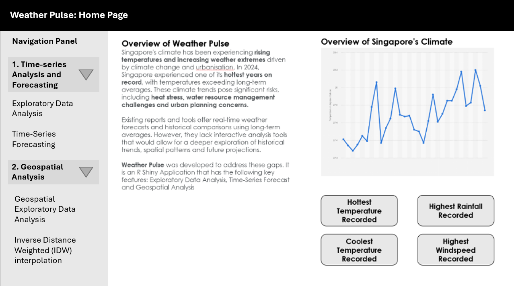
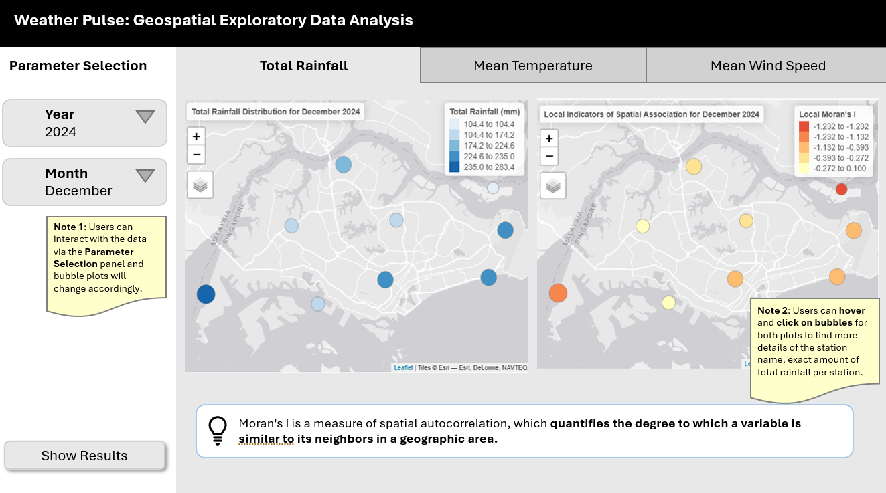
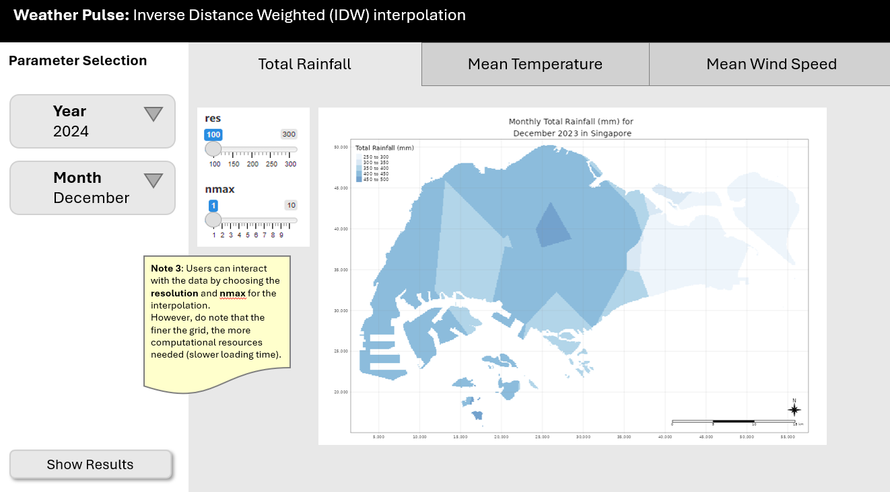

## 1 Overview of Task

In this take-home exercise, we are required to select one of the module of our proposed Shiny application and complete the following tasks:

-   To evaluate and determine the necessary R packages needed for your Shiny application are supported in R CRAN,

-   To prepare and test the specific R codes can be run and returned the correct output as expected,

-   To determine the parameters and outputs that will be exposed on the Shiny applications, and

-   To select the appropriate Shiny UI components for exposing the parameters determine above.

1️⃣ This take-home exercise must provide detail discussion and explanation of:

-   the data preparation process,

-   the selection of data visualisation techniques used,

-   and the data visualisation design and interactivity principles and best practices implemented.

2️⃣ It should also include a section called **UI design** for the different components of the UIs for the proposed design.

Our group has chosen to develop an interactive R Shiny application (Weather Pulse) designed to enhance the exploration and understanding of **Singapore’s evolving climate** by addressing gaps in historical trend analysis, spatial insights, and future projections.

## 2 Data Preparation

### 2.1 The Dataset

The dataset from [MSS website](https://www.weather.gov.sg/climate-historical-daily/) features extensive historical daily records that include measurements of daily rainfall, temperature, and wind speed. These records are collected from 64 weather stations (active and closed) cross Singapore, covering a period from 1980 to 2025.

As the data is stored disparately on the website, segmented by both month and by weather station, it must be scraped from the website and consolidated into a single dataset to be effectively utilised.

**R packages** that will be used for the data scraping and consolidation process are listed below:

1.  `dplyr`: This will be used in the data consolidation process as it offers functions for data manipulation and transformation.

2.  `lubridate`: This will be used for parsing, manipulating, and performing arithmetic on date-time objects.

```{r}
pacman::p_load(readxl, dplyr, readr, lubridate, sf, 
               tmap, DT, zoo, plotly, spdep, tidyverse,
               sp, ggplot2)
```

## 2.2 Scraping climate data from MSS website

The goal of our R Shiny application is to examine and analyze weather trends in Singapore **from 2020 to 2024**. To achieve this, we will first scrape the data readings of 44 active weather stations (19 full AWS stations, 25 rainfall stations) across Singapore from the MSS website and then proceed with data wrangling.

Code blocks below initializes the data scraping process by reading a list of station codes from a CSV file and setting up a loop to download data for the specified years and months:

```{r}
stations_df <- read_excel("data/StationList.xlsx")  
station_codes <- stations_df$StationID


stations_df <- st_as_sf(stations_df, coords = c("Long", "Lat"), crs = 4326)
stations_df <- st_transform(stations_df, 3414)
```

Code block to detail the main scraping loop:

```{r, eval=FALSE}
#| code-fold: true
#| code-summary: "Click to view full code for data scraping"
years <- 2020:2024
months <- sprintf("%02d", 1:12)

base_url <- "https://www.weather.gov.sg/files/dailydata/DAILYDATA_%s_%d%s.csv"

all_data <- list()
i <- 1

invisible({
  for (station in station_codes) {
    for (year in years) {
      for (month in months) {
        url <- sprintf(base_url, station, year, month)
        cat("Downloading:", url, "\n")
        
        # Attempt to read with latin1, if it fails, try UTF-8
        res <- try({
          read_csv(url, locale = locale(encoding = "latin1"), show_col_types = FALSE)
        }, silent = TRUE)
        
        if (inherits(res, "try-error")) {
          res <- try({
            read_csv(url, locale = locale(encoding = "UTF-8"), show_col_types = FALSE)
          }, silent = TRUE)
        }

        # If both fail, continue to the next file
        if (inherits(res, "try-error")) {
          cat("Failed to read:", url, "\n")
          next
        }

        res <- res %>%
          mutate(across(
            contains(c("Temperature", "Rainfall", "Wind")),
            ~ suppressWarnings(as.numeric(.))
          )) %>%
          mutate(
            station = as.character(station),
            year = as.integer(year),
            month = as.integer(month),
            Day = as.integer(Day)
          )
        
        all_data[[i]] <- res
        i <- i + 1
      }
    }
  }
})
```

::: callout-important
The data from January 2020 to March 2020 are encoded in `latin1`, while the data starting from April 2020 are encoded in `UTF-8`. Therefore, it is essential for the main scraping loop to be robust enough to accommodate both encodings effectively.
:::

## 2.3 Preparing Aspatial Data

### 2.3.1 Merging climate data and creating variables

```{r, eval=FALSE}
#| code-fold: true
#| code-summary: "Click to view code for combining extracted data and creating date column"
climate_data <- bind_rows(all_data)

climate_data <- climate_data %>%
  mutate(
    date = make_date(year, month, Day)
  )

write_csv(climate_data, "data/aspatial/climate_data.csv")
```

```{r}
climate_data <- read_csv("data/aspatial/climate_data.csv")
glimpse(climate_data)
```

### 2.3.2 Separating data into 3 datasets - rainfall, temperature and wind speed

To facilitate the development of the R Shiny application, the weather data was split into three separate datasets — rainfall, temperature, and wind speed. Each dataset contains only the relevant variables for the respective weather parameter, alongside essential metadata such as station name, date, and time components.

By isolating each weather component, users can independently explore trends, seasonality, and anomalies for rainfall, temperature, and wind speed. Additionally, this approach simplifies backend logic, improves processing efficiency, and avoids unnecessary overhead from unrelated columns during visualisation and analysis.

```{r}
climate_rainfall <- climate_data %>%
  select(Station, Year, Month, Day, date, station, year, month,
         contains("Rainfall"))

climate_temperature <- climate_data %>%
  select(Station, Year, Month, Day, date, station, year, month,
         contains("Temperature"))

climate_windspeed <- climate_data %>%
  select(Station, Year, Month, Day, date, station, year, month,
         contains("Wind"))

climate_all <- climate_data %>%
  select(Station, Year, Month, Day, date, station, year, month,
         contains("Rainfall"),
         contains("Temperature"),
         contains("Wind"))
```

## 2.4 Checking for Missing Data

### 2.4.1 Checking for missing values in datasets & filtering stations

Code blocks below identify and calculate the percentage of missing values for each of the weather variable dataset:

:::::: panel-tabset
## Rainfall

```{r}
#| code-fold: true
#| code-summary: "Click to view code"
rainfall_missing_by_station <- climate_rainfall %>%
  group_by(station) %>%
  summarise(across(
    contains("Rainfall"),
    ~mean(is.na(.)) * 100,
    .names = "missing_{.col}"
  )) %>%
  arrange(across(starts_with("missing"), desc))
rainfall_missing_by_station
```

::: callout-important
Based on the missing values analysis for the rainfall dataset, a few weather stations exhibit a significantly higher proportion of missing data (more than 5% of missing data), hence should be excluded from the analysis. This is because it may lead to biased trends and unreliable forecasts.

From the rainfall dataset, we have identified that weather stations **S29, S92, S64 and S06** should be excluded from the analysis.
:::

```{r}
stations_rainfall <- stations_df %>%
  filter(!StationID %in% c("S29", "S92", "S64", "S06"))
```

## Temperature

```{r}
#| code-fold: true
#| code-summary: "Click to view code"
temperature_missing_by_station <- climate_temperature %>%
  group_by(station) %>%
  summarise(across(
    contains("Temperature"),
    ~mean(is.na(.)) * 100,
    .names = "missing_{.col}"
  )) %>%
  arrange(across(starts_with("missing"), desc))
temperature_missing_by_station
```

::: callout-important
Based on the missing values analysis for the temperature dataset, a few weather stations exhibit a significantly higher proportion of missing data (more than 5% of missing data), hence should be excluded from the analysis. This is because it may lead to biased trends and unreliable forecasts.

From the temperature dataset, we have identified that weather stations **S07, S08, S112, S113, S114, S119, S123, S29, S33, S35, S40, S64, S66, S69, S71, S77, S78, S79, S81, S84, S88, S89, S90, S92, S94, S108, S23, S80, S25 and S06** should be excluded from the analysis.
:::

```{r}
stations_temperature <- stations_df %>%
  filter(!StationID %in% c("S07", "S08", "S112", "S113", "S114", "S119", "S123", "S29", "S33", "S35", "S40", "S64", "S66", "S69", "S71", "S77", "S78", "S79", "S81", "S84", "S88", "S89", "S90", "S92", "S94", "S80", "S23", "S108", "S25", "S06"))
```

## Windspeed

```{r}
#| code-fold: true
#| code-summary: "Click to view code"
windspeed_missing_by_station <- climate_windspeed %>%
  group_by(station) %>%
  summarise(across(
    contains("Wind"),
    ~mean(is.na(.)) * 100,
    .names = "missing_{.col}"
  )) %>%
  arrange(across(starts_with("missing"), desc))
windspeed_missing_by_station
```

::: callout-important
Based on the missing values analysis for the windspeed dataset, a few weather stations exhibit a significantly higher proportion of missing data (more than 5% of missing data), hence should be excluded from the analysis. This is because it may lead to biased trends and unreliable forecasts.

From the temperature dataset, we have identified that weather stations **S07, S08, S112, S113, S114, S119, S123, S29, S33, S35, S40, S64, S66, S69, S71, S77, S78, S79, S81, S84, S88, S89, S90, S92, S94, S80, S23, S60, S44, S50, S43 and S117** should be excluded from the analysis.
:::

```{r}
stations_wind <- stations_df %>%
  filter(!StationID %in% c("S07", "S08", "S112", "S113", "S114", "S119", "S123", "S29", "S33", "S35", "S40", "S64", "S66", "S69", "S71", "S77", "S78", "S79", "S81", "S84", "S88", "S89", "S90", "S92", "S94", "S80", "S23", "S60", "S44", "S50", "S43", "S117"))
```
::::::

### 2.4.2 Employing linear interpolation

For the purpose of analysis and the UI design, we should exclude the weather stations **that have more than 5% missing data.**

Apart from that, we employ linear interpolation to estimate the missing values for the weather stations with \<5% missing data, assuming a linear relationship between two known data points. This method is effective for datasets where changes between consecutive data points are expected to be gradual / linear (i.e. weather parameters).

Linear interpolation for missing values:

::: panel-tabset
## Rainfall

```{r}
#| code-fold: true
#| code-summary: "Click to view code"


climate_rainfall_interpolated <- climate_rainfall %>%
  inner_join(stations_rainfall, by = c("station" = "StationID")) %>%
  arrange(station, date) %>%
  group_by(station) %>%
  mutate(
    `Daily Rainfall Total (mm)`     = na.approx(`Daily Rainfall Total (mm)`, x = date, na.rm = FALSE),
    `Highest 30 Min Rainfall (mm)`  = na.approx(`Highest 30 Min Rainfall (mm)`, x = date, na.rm = FALSE),
    `Highest 60 Min Rainfall (mm)`  = na.approx(`Highest 60 Min Rainfall (mm)`, x = date, na.rm = FALSE),
    `Highest 120 Min Rainfall (mm)` = na.approx(`Highest 120 Min Rainfall (mm)`, x = date, na.rm = FALSE)
  ) %>%
  ungroup()
climate_rainfall_interpolated
```

## Temperature

```{r}
#| code-fold: true
#| code-summary: "Click to view code"


climate_temperature_interpolated <- climate_temperature %>%
  inner_join(stations_temperature, by = c("station" = "StationID")) %>%
  arrange(station, date) %>%
  group_by(station) %>%
  mutate(
    `Mean Temperature (°C)`     = na.approx(`Mean Temperature (°C)`, x = date, na.rm = FALSE),
    `Maximum Temperature (°C)`  = na.approx(`Maximum Temperature (°C)`, x = date, na.rm = FALSE),
    `Minimum Temperature (°C)`  = na.approx(`Minimum Temperature (°C)`, x = date, na.rm = FALSE)
  ) %>%
  ungroup()
climate_temperature_interpolated
```

## Windspeed

```{r}
#| code-fold: true
#| code-summary: "Click to view code"


climate_all_filtered <- climate_all %>%
  inner_join(stations_wind, by = c("station" = "StationID")) %>%
  arrange(station, date) %>%
  group_by(station) %>%
  mutate(
    `Mean Wind Speed (km/h)`     = na.approx(`Mean Wind Speed (km/h)`, x = date, na.rm = FALSE),
    `Max Wind Speed (km/h)`  = na.approx(`Max Wind Speed (km/h)`, x = date, na.rm = FALSE)
  ) %>%
  ungroup()
climate_windspeed_interpolated
```
:::

## 2.5 Preparing Geospatial Data

In order to visualize the climate data on the map of Singapore for geospatial analysis, we will first need to transform the data and map the 9 weather station points to the **SVY21 system**.

```{r}
climate_all_interpolated <- climate_all %>%
  inner_join(stations_wind, by = c("station" = "StationID")) %>%
  arrange(station, date) %>%
  group_by(station) %>%
  mutate(
    `Daily Rainfall Total (mm)`     = na.approx(`Daily Rainfall Total (mm)`, x = date, na.rm = FALSE),
    `Highest 30 Min Rainfall (mm)`  = na.approx(`Highest 30 Min Rainfall (mm)`, x = date, na.rm = FALSE),
    `Highest 60 Min Rainfall (mm)`  = na.approx(`Highest 60 Min Rainfall (mm)`, x = date, na.rm = FALSE),
    `Highest 120 Min Rainfall (mm)` = na.approx(`Highest 120 Min Rainfall (mm)`, x = date, na.rm = FALSE),
     `Mean Temperature (°C)`     = na.approx(`Mean Temperature (°C)`, x = date, na.rm = FALSE),
    `Maximum Temperature (°C)`  = na.approx(`Maximum Temperature (°C)`, x = date, na.rm = FALSE),
    `Minimum Temperature (°C)`  = na.approx(`Minimum Temperature (°C)`, x = date, na.rm = FALSE),
     `Mean Wind Speed (km/h)`     = na.approx(`Mean Wind Speed (km/h)`, x = date, na.rm = FALSE),
    `Max Wind Speed (km/h)`  = na.approx(`Max Wind Speed (km/h)`, x = date, na.rm = FALSE)
  ) %>%
  ungroup()
```

```{r}
climate_geospatial <- st_as_sf(climate_all_interpolated, crs = 3414)
write_rds(climate_geospatial, "data/rds/climate_geospatial.rds")
```

```{r}
climate_rainfall3414 <- st_as_sf(climate_rainfall_interpolated, crs = 3414)
climate_temperature3414 <- st_as_sf(climate_temperature_interpolated, crs = 3414)
climate_windspeed3414 <- st_as_sf(climate_windspeed_interpolated, crs = 3414)
```

```{r}
write_rds(climate_rainfall3414, "data/rds/climate_rainfall3414.rds")
write_rds(climate_temperature3414, "data/rds/climate_temperature3414.rds")
write_rds(climate_windspeed3414, "data/rds/climate_windspeed3414.rds")
```

## 3 Geospatial Exploratory Data Analysis

### 3.1 Bubble Map - Visualising Weather Variables

Before going into the actual UI design of the Shiny app for geospatial analysis, we will first develop the function which will allow users to select and interact with the following parameters:

| Parameter | Description | UI for Parameter Selection |
|----|----|----|
| `Year` | The year from which the data is drawn. | Dropdown List |
| `Month` | The month from which the data is drawn. | Dropdown List |

There will be 3 functions created namely for (i) monthly total rainfall, (ii) average temperature and (iii) average windspeed which will all output interactive plots that will visually show the distribution of weather variables across Singapore.

#### 3.1.1 Function to visualise monthly total rainfall

```{r}
#| code-fold: true
#| code-summary: "Click to view code block for function to calculate monthly total rainfall"
# Function to generate rainfall map
plot_rainfall_map <- function(data, selected_year, selected_month) {
  
  # Aggregate rainfall data by Station, Year, and Month
  aggregated_data <- data %>%
    mutate(Year = year(date), Month = month(date, label = TRUE, abbr = FALSE)) %>%
    group_by(Station, Year, Month) %>%
    summarise(
      Total_Rainfall = sum(`Daily Rainfall Total (mm)`, na.rm = TRUE),
      geometry = first(geometry),  # Preserve unique geometry for each station
      .groups = "drop"
    ) %>%
    st_as_sf(crs = 3414)
  
  # Convert Month to character before filtering
  filtered_data <- aggregated_data %>%
    filter(Year == selected_year, as.character(Month) == as.character(selected_month))
  
  # Handle empty data case
  if (nrow(filtered_data) == 0) {
    return(tm_shape() + tm_layout(main.title = "No data available for the selected year and month."))
  }
  
  # Set interactive map mode
  tmap_mode("view")
  
  # Create map with new syntax for tmap v4
  map <- tm_shape(filtered_data) +
    tm_bubbles(
      size = "Total_Rainfall",
      col = "Total_Rainfall",  # Fill color for the bubbles
      palette = "Blues",       # Palette for fill color
      size.legend.size = 0.5,  # Adjust the size legend scaling
      legend.size.show = TRUE, # Show size legend
      legend.fill.show = TRUE, # Show fill color legend
      border.col = "black",    # Outline color for bubbles
      title.size = "Total Rainfall (mm)"
    ) +
    tm_layout(
      main.title = paste("Total Rainfall for", selected_month, selected_year),
      main.title.size = 1.5,
      legend.outside = TRUE
    )
  
  return(map)
}
```

```{r}
plot_rainfall_map(climate_rainfall3414, 2024, "June")
```

#### 3.1.2 Function to visualise average monthly temperature

```{r}
#| code-fold: true
#| code-summary: "Click to view code block for function to calculate average monthly temperature"
# Function to generate temperature map  
plot_temperature_map <- function(data, selected_year, selected_month) {
  
  # Aggregate temperature data by Station, Year, and Month
  aggregated_data <- data %>%
    mutate(Year = year(date), Month = month(date, label = TRUE, abbr = FALSE)) %>%
    group_by(Station, Year, Month) %>%
    summarise(
      Mean_Temperature = mean(`Mean Temperature (°C)`, na.rm = TRUE),
      geometry = first(geometry),  # Preserve unique geometry for each station
      .groups = "drop"
    ) %>%
    st_as_sf(crs = 3414)  # Ensure it's an sf object
  
  # Filter data for the selected year and month
  filtered_data <- aggregated_data %>%
    filter(Year == selected_year, as.character(Month) == as.character(selected_month))
  
  # Handle empty data case
  if (nrow(filtered_data) == 0) {
    return(tm_shape() + tm_layout(main.title = "No data available for the selected year and month."))
  }
  
  # Set interactive map mode
  tmap_mode("view")
  
  # Create map with bubbles
  map <- tm_shape(filtered_data) +
    tm_bubbles(
      size = "Mean_Temperature",       # Bubble size based on Mean Temperature
      col = "Mean_Temperature",        # Bubble color based on Mean Temperature
      palette = "Reds",                # Change the color palette to Reds
      size.legend.size = 0.5,          # Adjust the size legend scaling factor
      legend.size.show = TRUE,         # Show size legend
      legend.fill.show = TRUE,         # Show fill color legend
      border.col = "black",            # Outline color for bubbles
      title.size = "Mean Temperature (°C)"
    ) +
    tm_layout(
      main.title = paste("Mean Temperature for", selected_month, selected_year),
      main.title.size = 1.5,
      legend.outside = TRUE
    )
  
  return(map)
}
```

```{r}
plot_temperature_map(climate_temperature3414, 2024, "December")
```

#### 3.1.3 Function to visualise average monthly wind speed

```{r}
#| code-fold: true
#| code-summary: "Click to view code block for function to calculate average monthly windspeed"
# Function to generate wind speed map  
plot_windspeed_map <- function(data, selected_year, selected_month) {
  
  # Aggregate wind speed data by Station, Year, and Month
  aggregated_data <- data %>%
    mutate(Year = year(date), Month = month(date, label = TRUE, abbr = FALSE)) %>%
    group_by(Station, Year, Month) %>%
    summarise(
      Mean_Wind_Speed = mean(`Mean Wind Speed (km/h)`, na.rm = TRUE),
      geometry = first(geometry),  # Preserve unique geometry for each station
      .groups = "drop"
    ) %>%
    st_as_sf(crs = 3414)  # Ensure it's an sf object
  
  # Filter data for the selected year and month
  filtered_data <- aggregated_data %>%
    filter(Year == selected_year, as.character(Month) == as.character(selected_month))
  
  # Handle empty data case
  if (nrow(filtered_data) == 0) {
    return(tm_shape() + tm_layout(main.title = "No data available for the selected year and month."))
  }
  
  # Set interactive map mode
  tmap_mode("view")
  
  # Create map with bubbles
  map <- tm_shape(filtered_data) +
    tm_bubbles(
      size = "Mean_Wind_Speed",       # Bubble size based on Mean Wind Speed
      col = "Mean_Wind_Speed",        # Bubble color based on Mean Wind Speed
      palette = "Greens",             # Change the color palette to Greens
      size.legend.size = 0.5,         # Adjust the size legend scaling factor
      legend.size.show = TRUE,        # Show size legend
      legend.fill.show = TRUE,        # Show fill color legend
      border.col = "black",           # Outline color for bubbles
      title.size = "Mean Wind Speed (km/h)"
    ) +
    tm_layout(
      main.title = paste("Mean Wind Speed for", selected_month, selected_year),
      main.title.size = 1.5,
      legend.outside = TRUE
    )
  
  return(map)
}

```

```{r}
plot_windspeed_map(climate_windspeed3414, 2024, "December")
```

### 3.2 Spatial autocorrelation - Local Moran's I

Moran's I is a measure of spatial autocorrelation, which **quantifies the degree to which a variable is similar to its neighbors in a geographic area.** It is often used in spatial statistics to assess patterns of clustering or dispersion in spatial data.

**Local Moran's I** (also known as Local Indicators of Spatial Association - LISA) will further identify any localized clusters or outliers in the data.

::: callout-important
**Local Moran's I** **\> 0** indicates that similar values are clustered together in space. In other words, if the value of a variable at one location is high, nearby locations are likely to have high values as well.

**Local Moran's I = 0** indicates random spatial autocorrelation, meaning that the values are randomly distributed.

**Local Moran's I \< 0** indicates spatial dissimilarity — locations with high values of the variable are surrounded by locations with low values, or vice versa.
:::

#### 3.2.1 Function to visualise spatial association for rainfall

```{r}
#| code-fold: true
#| code-summary: "Click to view code block for functions to calculate and plot LISA"

localmoran_i_rainfall <- function(data, year, month, k_neighbors = 2) {
  
  data <- data %>%
    mutate(Year = year(date), Month = month(date, label = TRUE, abbr = FALSE)) %>%
    group_by(Station, Year, Month) %>%
    summarise(Total_Rainfall = sum(`Daily Rainfall Total (mm)`, na.rm = TRUE), .groups = "drop")
  
  filtered_data <- data %>%
    filter(Year == year, Month == month)
  
  sf_data <- st_as_sf(filtered_data, coords = c("Longitude", "Latitude"), crs = 3414)
  
  coordinates <- st_coordinates(sf_data)
  coordinates <- as.data.frame(coordinates)
  coordinates[] <- lapply(coordinates, as.numeric)
  
  neighbors <- knearneigh(coordinates, k = k_neighbors)  
  weights <- nb2listw(knn2nb(neighbors), style = "W")  
  
  variable <- filtered_data$Total_Rainfall
  local_moran_result <- localmoran(variable, weights)
  
  filtered_data$Local_Moran_I <- local_moran_result[, 1]  
  
  sf_data$Local_Moran_I <- filtered_data$Local_Moran_I
  
  return(sf_data)
}

plot_rainfall_morani <- function(data, year, month, k_neighbors = 2) {
  tmap_mode("view")
  
  rainfall_morani <- tm_shape(data) +
    tm_symbols(size = "Total_Rainfall", col = "Local_Moran_I", 
               scale = 3, style = "jenks", palette = "Blues", 
               title.size = "Local Moran's I", 
               title.col = "Local Moran's I",
               popup.vars = c("Station", "Total_Rainfall", "Local_Moran_I")) +
    tm_layout(title = paste("Local Indicators of Spatial Association for", month, year))
  
  return(rainfall_morani)
}

```

```{r}
#| code-fold: true
#| code-summary: "Click to view code for printing summary table"
rainfall_map_data <- localmoran_i_rainfall(climate_rainfall3414, 2024, "December")
rainfall_map_selected <- rainfall_map_data %>%
  st_drop_geometry() %>%
  select(Station, Total_Rainfall, Local_Moran_I)
print(rainfall_map_selected)
```

```{r}
plot_rainfall_morani(rainfall_map_data, 2024, "December")
```

::: callout-important
Areas like Tuas South and Jurong Island have Local Moran I values indicative of a spatial cluster, hence the high rainfall could be due to a spatial correlation.
:::

#### 3.2.2 Function to visualise spatial association for mean temperature

```{r}
localmoran_i_temperature <- function(data, year, month, k_neighbors = 2) {
  
  data <- data %>%
    mutate(Year = year(date), Month = month(date, label = TRUE, abbr = FALSE)) %>%
    group_by(Station, Year, Month) %>%
    summarise(Mean_Temperature = mean(`Mean Temperature (°C)`, na.rm = TRUE), .groups = "drop")
  
  filtered_data <- data %>%
    filter(Year == year, Month == month)
  
  sf_data <- st_as_sf(filtered_data, coords = c("Longitude", "Latitude"), crs = 3414)
  
  coordinates <- st_coordinates(sf_data)
  coordinates <- as.data.frame(coordinates)
  coordinates[] <- lapply(coordinates, as.numeric)
  
  neighbors <- knearneigh(coordinates, k = k_neighbors)  
  weights <- nb2listw(knn2nb(neighbors), style = "W")  
  
  variable <- filtered_data$Mean_Temperature
  local_moran_result <- localmoran(variable, weights)
  
  filtered_data$Local_Moran_I <- local_moran_result[, 1]  
  
  sf_data$Local_Moran_I <- filtered_data$Local_Moran_I
  
  return(sf_data)
}

plot_temperature_morani <- function(data, year, month, k_neighbors = 2) {
  tmap_mode("view")
  
  temperature_morani <- tm_shape(data) +
    tm_symbols(size = "Mean_Temperature", col = "Local_Moran_I", 
               scale = 3, style = "jenks", palette = "Reds", 
               title.size = "Local Moran's I", 
               title.col = "Local Moran's I",
               popup.vars = c("Station", "Mean_Temperature", "Local_Moran_I")) +
    tm_layout(title = paste("Local Indicators of Spatial Association for", month, year))
  
  return(temperature_morani)
}

```

```{r}
#| code-fold: true
#| code-summary: "Click to view code for printing summary table"
temperature_map_data <- localmoran_i_temperature(climate_temperature3414, 2024, "December")
temperature_map_selected <- temperature_map_data %>%
  st_drop_geometry() %>%
  select(Station, Mean_Temperature, Local_Moran_I)
print(temperature_map_selected)
```

```{r}
plot_temperature_morani(temperature_map_data, 2024, "December")
```

#### 3.2.3 Function to visualise spatial association for mean windspeed

```{r}
# Function to generate mean wind speed auto correlation map
localmoran_i_windspeed <- function(data, year, month, k_neighbors = 2) {
  
  data <- data %>%
    mutate(Year = year(date), Month = month(date, label = TRUE, abbr = FALSE)) %>%
    group_by(Station, Year, Month) %>%
    summarise(Mean_Wind_Speed = mean(`Mean Wind Speed (km/h)`, na.rm = TRUE), .groups = "drop")
  
  filtered_data <- data %>%
    filter(Year == year, Month == month)
  
  sf_data <- st_as_sf(filtered_data, coords = c("Longitude", "Latitude"), crs = 3414)
  
  coordinates <- st_coordinates(sf_data)
  coordinates <- as.data.frame(coordinates)
  coordinates[] <- lapply(coordinates, as.numeric)
  
  neighbors <- knearneigh(coordinates, k = k_neighbors)  
  weights <- nb2listw(knn2nb(neighbors), style = "W")  
  
  variable <- filtered_data$Mean_Wind_Speed
  local_moran_result <- localmoran(variable, weights)
  
  filtered_data$Local_Moran_I <- local_moran_result[, 1]  
  
  sf_data$Local_Moran_I <- filtered_data$Local_Moran_I
  
  return(sf_data)
}

plot_windspeed_morani <- function(data, year, month, k_neighbors = 2) {
  tmap_mode("view")
  
  windspeed_morani <- tm_shape(data) +
    tm_symbols(size = "Mean_Wind_Speed", col = "Local_Moran_I", 
               scale = 3, style = "jenks", palette = "Blues", 
               title.size = "Local Moran's I", 
               title.col = "Local Moran's I",
               popup.vars = c("Station", "Mean_Wind_Speed", "Local_Moran_I")) +
    tm_layout(title = paste("Local Indicators of Spatial Association for", month, year))
  
  return(windspeed_morani)
}

```

```{r}
#| code-fold: true
#| code-summary: "Click to view code for printing summary table"
windspeed_map_data <- localmoran_i_windspeed(climate_windspeed3414, 2024, "December")
windspeed_map_selected <- windspeed_map_data %>%
  st_drop_geometry() %>%
  select(Station, Mean_Wind_Speed, Local_Moran_I)
print(windspeed_map_selected)
```

```{r}
plot_windspeed_morani(windspeed_map_data, 2024, "December")
```

### 3.3 Inverse Distance Weighted (IDW) interpolation

Inverse Distance Weighted (IDW) interpolation is a spatial interpolation technique used to **estimate values at unknown locations based on nearby observed data points.** It assumes that points closer to the unknown location have a greater influence on the estimated value than points farther away.

### 3.3.1 Loading Packages and Boundary Shapefile

```{r}
pacman::p_load(gstat)
```

```{r}
#| code-fold: true
#| code-summary: "Click to view code for loading Singapore boundary shapefile"
mpsz <- st_read(dsn = "data/geospatial", 
                layer = "MP14_SUBZONE_WEB_PL")
mpsz <- st_transform(mpsz, crs = 3414)
st_crs(mpsz)
```

```{r}
#| code-fold: true
#| code-summary: "Click to view code for setting minimum and maximum for interpolation random points" 

bbox <- st_bbox(mpsz)

bbox <- st_transform(bbox, crs = 3414)

lon_min <- bbox["xmin"]
lon_max <- bbox["xmax"]
lat_min <- bbox["ymin"]
lat_max <- bbox["ymax"]
```

### 3.3.2 IDW interpolation function for total rainfall

```{r}
#| code-fold: true
#| code-summary: "Click to view code block for function - rainfall"
generate_idw_rainfall <- function(data, resolution, nmax) {
  
  set.seed(123)
  
  # Calculate the number of random points based on resolution
  n_points <- ceiling((lon_max - lon_min) / resolution) * ceiling((lat_max - lat_min) / resolution)
  
  # Generate random points within the bounding box
  random_points <- data.frame(
    X = runif(n_points, lon_min, lon_max),
    Y = runif(n_points, lat_min, lat_max)
  )
  
  # Convert these random points to an sf object with the correct CRS
  random_points_sf <- st_as_sf(random_points, coords = c("X", "Y"), crs = 3414)
  
  # Perform IDW interpolation using the provided climate data
  idw_rainfall_random <- idw(formula = value_rainfall ~ 1, 
                              locations = data, 
                              newdata = random_points_sf, 
                              nmax = nmax)  # Set nmax for interpolation
  
  # Convert the IDW results into a spatial object
  coords <- st_coordinates(idw_rainfall_random)
  idw_rainfall_sf <- cbind(idw_rainfall_random, coords)
  idw_rainfall_sf <- st_as_sf(idw_rainfall_sf, coords = c("X", "Y"), crs = 3414)

  # Clip points to Singapore boundary
  idw_rainfall_sf <- idw_rainfall_sf[mpsz, ]
  
  # Visualize the result using tmap
  tmap_mode("plot")
  map <- tm_shape(idw_rainfall_sf) +
    tm_bubbles(col = "var1.pred", 
               size = "var1.pred", 
               scale = 4, style = "jenks", palette = "Blues",  
               border.col = "black", 
               border.lwd = 0.5) +
  tm_layout(
    title = "Interpolated Rainfall at Random Points in Singapore",
    frame = TRUE,          
    frame.lwd = 2,         
    title.size = 1.5
  )
  
  tmap_mode("view")
  # Return the map object and the interpolation result
  return(map)
}
```

To rename column name to be used in function and replace NA values:

```{r}
#| code-fold: true
#| code-summary: "Click to view code"
names(climate_rainfall3414)[names(climate_rainfall3414) == "Daily Rainfall Total (mm)"] <- "value_rainfall"

climate_rainfall3414$value_rainfall[is.na(climate_rainfall3414$value_rainfall)] <- 0

```

To convert climate_rainfall to `sf object` with the same crs :

```{r}
#| code-fold: true
#| code-summary: "Click to view code"
climate_rainfall3414 <- st_as_sf(climate_rainfall3414, coords = c("X", "Y"), crs = 3414)
inherits(climate_rainfall3414, "sf") 
```

Plot the IDW interpolation map:

```{r}
generate_idw_rainfall(climate_rainfall3414, resolution = 4000, nmax = 5)

```

## 4 UI Prototype Design

### 4.1 Home Page



### 4.2 Geospatial Exploratory Data Analysis



### 4.3 Inverse Distance Weighted (IDW) interpolation


